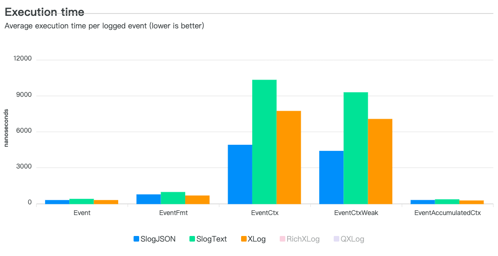
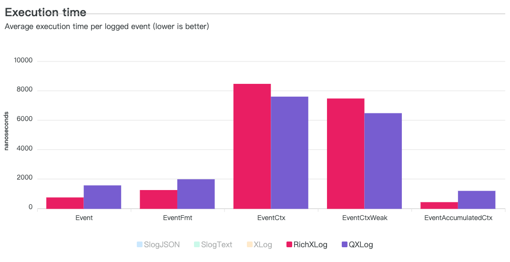

## XLog Library

XLog is a standardized-interface, pluggable, light-weight, high-performance and structured logging library.
It provided default implementation based-on Golang Slog.
It is convenient to adapt standardized-interface implementation of any Golang logging libraries.

### Goal

- Standardize logging interface
- Performance higher than Golang Slog and QXLog
- Adapt other logging library as standardized-interface, conveniently

### Requirements

- Go 1.20+

### Usage

#### Installation

Download the library of Go client to local environment:

```go
go get -u "github.com/goqianjin/common-libs/xlog"
```

#### Logging by package functions

Here's an example:

```go
// Basic logs.
xlog.Debug(context.Background(), "debug level message")
xlog.Info(context.Background(), "info level message")

// Add extra keys to the log.
xlog.Info(context.Background(), "logging with some extra metadata", "api", "GetUser", "userName", "Tom")

// Log the error and set exit code as 1.
xlog.Fatal(context.Background(), "logging and then exit with 1")

// Add constant keys to the log context.
xlog.SetAddSource(true) // global default set to add source information
_, ctx := xlog.New(xlog.WithRequestID("DgiAk8Fnh6R8GPIX"), xlog.WithArgs("service", "account", "api", "GetUser"))
xlog.Info(ctx, "logging with constant keys")
```

#### Logging by logger methods

Here's an example:

```go
// create a logger
logger, ctx := xlog.New(xlog.WithRequestID("DgiAk8Fnh6R8GPIX"), xlog.WithArgs("service", "account", "api", "GetUser"))

// Basic logs.
logger.Debug("debug level message")
logger.Info("info level message")

// Add extra keys to the log.
logger.Info("logging with some extra metadata", "api", "GetUser", "userName", "Tom")

// Log the error and set exit code as 1.
logger.Fatal("logging and then exit with 1")

// Add constant keys to the log context.
// global default set to add source information
xlog.SetAddSource(true) 
logger, ctx := xlog.New(xlog.WithRequestID("DgiAk8Fnh6R8GPIX"), xlog.WithArgs("service", "account", "api", "GetUser"))
// Add another constant key after logging instance created
xlog.PutContextAttibute(ctx, xlog.NewAttr("anotherConstantKey", 123))
logger.Info("logging with constant keys")
```

### Comparison

##### XLog has higher performance than both SLog JSON handle and SLog Text handler.




##### XLog has higher performance than Qiniu XLog library
- the cost of `EventCtx` and `EventCtxWeak` kinds is inaccurate, as Qiniu XLog doesn't support 
   passing extra arguments after logging message context.
- `Rich` indicates logging within requestID and source prefix (Qiniu XLog always includes them)




### Contributing

Contributions are welcomed and greatly appreciated. See CONTRIBUTING.md for details on submitting patches
and the contribution workflow.
